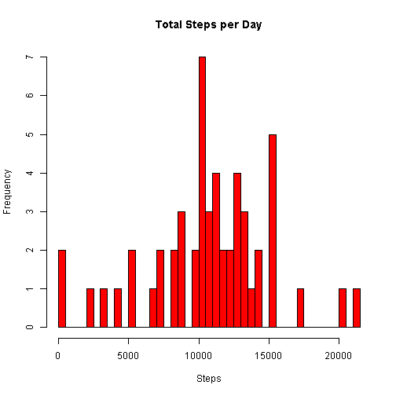
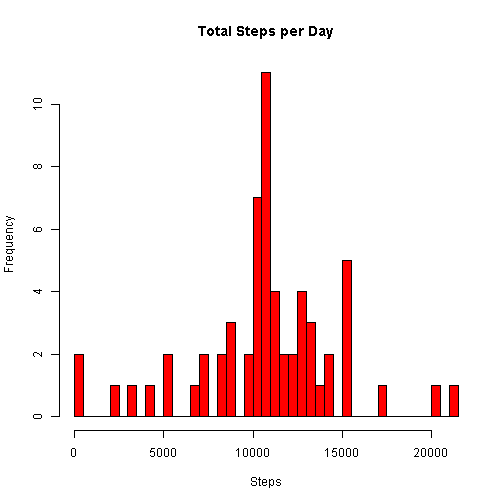
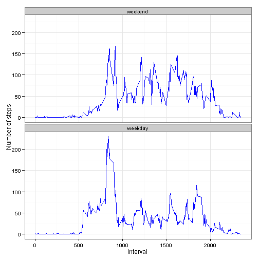

This is an R Markdown document. 
It will be used to answer teh questions of Reproductible Research Peer Assessment 1

Loading and preprocessing the data

```r
library(knitr)
```


-Show any code that is needed to Load the data 


```r
dat<-read.csv("activity.csv")
```

What is mean total number of steps taken per day?

-Make a histogram of the total number of steps taken each day


```r
sdat<-aggregate(steps ~ date, data = dat, sum)
with(sdat, hist(steps, breaks=53, col=2, main= "Total Steps per Day", xlab="Steps"))
```

 

-Calculate and report the mean and median total number of steps taken per day


```r
mean(sdat$steps)
```

```
## [1] 10766.19
```

```r
median(sdat$steps)
```

```
## [1] 10765
```
The mean is 1.0766189 &times; 10<sup>4</sup> and the median is 10765

What is the average daily activity pattern?

-Make a time series plot (i.e. type = "l") of the 5-minute interval (x-axis) and the average number of steps taken, averaged across all days (y-axis)


```r
ddat<-aggregate(steps ~ interval, data = dat, mean)
with (ddat, plot(interval, steps, type="l"))
```

 

-Which 5-minute interval, on average across all the days in the dataset, contains the maximum number of steps?


```r
ms<-max(ddat$steps)
rowofmax<-which.max(ddat$steps)
mint<-ddat[rowofmax,1]
```
The maximum number of steps are 206.1698113 and occurs on 835th interval

Imputing missing values

-Calculate and report the total number of missing values in the dataset (i.e. the total number of rows with NAs)


```r
nt<-nrow(dat)      #number of total rows
xdat<-na.omit(dat) #subset with no missing values
nnm<-nrow(xdat)    #number of rows with no missing valuee
nm<-nt-nnm         #number of rows with missing values
```
Total missing values are 2304

-Devise a strategy for filling in all of the missing values in the dataset. The strategy does not need to be sophisticated. For example, you could use the mean/median for that day, or the mean for that 5-minute interval, etc.

**The strategy will be to substitute every NA with the mean for that 5-minute interval**

-Create a new dataset that is equal to the original dataset but with the missing data filled in.


```r
ndat<-dat
for (i in 1:nt) {
  if (is.na(dat[i,1]==TRUE)){ 
      for (j in 1:nrow(ddat)){
           if (dat[i,3]==ddat[j,1]){
               ndat[i,1]=ddat[j,2]}
           }
  }
}
```

-Make a histogram of the total number of steps taken each day and Calculate and report the mean and median total number of steps taken per day. Do these values differ from the estimates from the first part of the assignment? What is the impact of imputing missing data on the estimates of the total daily number of steps?


```r
nsdat<-aggregate(steps ~ date, data = ndat, sum)
with(nsdat, hist(steps, breaks=61, col=2, main= "Total Steps per Day", xlab="Steps"))
```

 

```r
mean(nsdat$steps)
```

```
## [1] 10766.19
```

```r
median(nsdat$steps)
```

```
## [1] 10766.19
```
The new mean is 1.0766189 &times; 10<sup>4</sup> and the new median is 1.0766189 &times; 10<sup>4</sup>

**There is no actual impact on data before and after imputing missing data
mean remain the same while we observe a slight chenge in median**

Are there differences in activity patterns between weekdays and weekends?

-Create a new factor variable in the dataset with two levels -- "weekday" and "weekend" indicating whether a given date is a weekday or weekend day.


```r
Sys.setlocale("LC_ALL", "en")
```

```
## [1] "LC_COLLATE=English_United States.1252;LC_CTYPE=English_United States.1252;LC_MONETARY=English_United States.1252;LC_NUMERIC=C;LC_TIME=English_United States.1252"
```

```r
Sys.setenv("LANGUAGE" = "en")
newdat<-cbind(ndat, weekday="weekday")
newdat$weekday = factor(newdat$weekday, levels=c(levels(newdat$weekday), "weekend"))
for (i in 1:nrow(xndat)) {
  if (weekdays(as.Date(newdat[i,2]))=="Saturday"){newdat[i,4]<-"weekend"} 
  if (weekdays(as.Date(newdat[i,2]))=="Sunday"){newdat[i,4]<-"weekend"}
}
```

-Make a panel plot containing a time series plot (i.e. type = "l") of the 5-minute interval (x-axis) and the average number of steps taken, averaged across all weekday days or weekend days (y-axis). 


```r
require(plyr)
require(ggplot2)
newweekday<-newdat[newdat$weekday=="weekday",]
newweekend<-newdat[newdat$weekday=="weekend",]
ddatday<-aggregate(steps ~ interval, data = newweekday, mean)
ddatend<-aggregate(steps ~ interval, data = newweekend, mean)
ddatday<-cbind(ddatday, weekday="weekday")
ddatend<-cbind(ddatend, weekday="weekend")
ddatall<-rbind(ddatend,ddatday)
print(ggplot(ddatall, aes(x=interval, y=steps)) + 
        geom_line(color="blue") + 
        facet_wrap(~ weekday, nrow=2, ncol=1) +
        labs(x="Interval", y="Number of steps")
      +  theme_bw())
```

 
